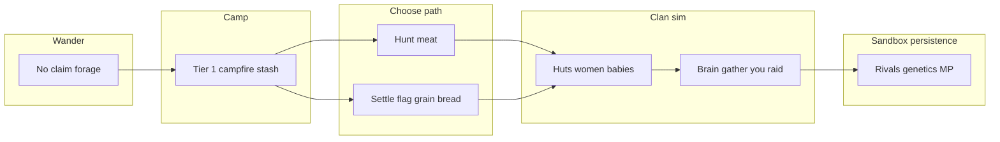

# Big picture — systems map (workshop doc)

**Status:** Oct 2026 — **macro design**, not tuning or edge cases.  
**Use this file** when the goal is to **flesh out whole systems** and how they connect.  
**Do not use this file** for hunger tie-breaks, menu copy, or values that will move every sprint.

**Micro player UX locks** from Q&A live in [player_fantasy_skeleton.md](player_fantasy_skeleton.md).  
**Full inventory + lock workflow:** [systems_canon_master.md](systems_canon_master.md).

---

## What this game is (one sentence)

**Persistent multiplayer stone-age sim:** you direct one man in a clan on a shared world; the camp **lives** (food, people, craft, war) whether you watch it or not; over generations **genetics and rivalry** decide whose bloodline shapes the map — with **no server-wide “campaign over.”**

---

## Five pillars (what must all stay true)

| Pillar | Player feels | Main systems |
|--------|----------------|--------------|
| **Survive** | Hunger and stockpile pressure are **visible** and fair | Personal calories, **land claim inventory**, gather, hunt, forage biomes |
| **Village** | A **camp** (hearth, piles, huts, corral), not an RPG building menu | Territory tiers, placement, **authentic layout**, production stations, women’s work |
| **Dynasty** | Babies, hybrids, succession — **generational** stakes | Reproduction, Living Hut, genetics/lineage (planned), player death → next clansman |
| **War chief** | Raids, defense, horn, steal herds — **you** call violence on your clan | RTS/party, raid verbs, agro/combat, ClanBrain (AI does full loop) |
| **Living world** | Other clans **keep playing** off-screen; new players join | Chunks + seed + mutations, **dormancy record**, MP server, island/biomes |

---

## Player journey (phases — not a tutorial script)

**Design intent:** Phases **overlap** (sandbox). No forced chapter 2. Food comfort unlocks **risk** (explore, war, breed), not a cutscene.

---

## Macro systems — flesh status

**Rich** = owner doc + code or clear design lock. **Partial** = pieces exist, **whole loop** unclear. **Hollow** = brainstorm / future folder only.

| # | System | Job in the fantasy | Best doc(s) | Flesh |
|---|--------|---------------------|-------------|-------|
| 1 | **World shell** | Same map for everyone; chunks; props deplete and mutate | [game_map.md](game_map.md), [environment_goal.md](environment_goal.md) | Partial |
| 2 | **Dormancy / record** | AI camps live off-screen; believable on arrival | [dormancy.md](dormancy.md) | Rich (design); build in progress |
| 3 | **Territory** | Campfire nomad → flag settle; radius; relocate | [nomad.md](nomad.md), [earlygame_vision.md](earlygame_vision.md) | Partial |
| 4 | **Economy & camp layout** | Hearth-centric village; stations not factory buildings | [village_and_economy_rundown.md](village_and_economy_rundown.md), [economy_catalog.md](economy_catalog.md) | Partial |
| 5 | **Food & calories** | Clan buffer + personal hunger; crisis behavior | [earlygame_vision.md](earlygame_vision.md) §2, repro guide, skeleton Q28–30 | Partial |
| 6 | **ClanBrain & jobs** | Quotas, pressures, who gathers/defends/searches; **player vs AI split** | [ai_clan_brain.md](ai_clan_brain.md), [production_economy.md](production_economy.md) | Partial |
| 7 | **Herding & people** | Wild women/animals → claim; cordage steal | [HERDING_SYSTEM_GUIDE.md](HERDING_SYSTEM_GUIDE.md), [herdable_raiding.md](future%20implementations/herdable_raiding.md) | Partial |
| 8 | **Hunt & prey** | AoH, player RTS hunt vs AI hunt intent | [hunting.md](hunting.md), [Phase4/raiding_hunting.md](Phase4/raiding_hunting.md) | Partial |
| 9 | **Raid & diplomacy** | Four verbs; loot before wipe; brain scoring | [raid.md](raid.md), earlygame §4, R2–R3 ⬜ | Hollow–Partial |
| 10 | **Combat & defense** | Agro, defend ring, corpses, claim under attack | [AgroGuide.md](AgroGuide.md), combat in [bible.md](bible.md) §X | Partial (code-heavy) |
| 11 | **Population & genetics** | Babies, caps, hybridization, **long-horizon domination** | [reproduction_guide.md](reproduction_guide.md), [genetics.md](genetics.md) | Partial / genetics hollow |
| 12 | **Player command** | Horn, party, follow/defend — primitive orders | [rts.md](rts.md), [party_ui.md](party_ui.md) | Partial |
| 13 | **Multiplayer persistence** | Server keeps sim; join mid-world; disconnect → brain | [multiplayer.md](multiplayer.md), [island_mp.md](future%20implementations/island_mp.md) | Hollow–Partial |

---

## Stories systems must produce (integration tests for design)

If these **emergent stories** are impossible, a macro system is still hollow:

1. **Walk away, come back** — left a stocked flag; return to more children and less wood; not a frozen diorama ([dormancy.md](dormancy.md)).
2. **Food shock** — buffer crashes; brain shifts; player chooses hunt or raid; clan doesn’t die from invisible rules ([earlygame_vision.md](earlygame_vision.md), skeleton).
3. **Raid for blood** — steal herd or loot; enemy weakens; genetics mix if women join ([herdable_raiding.md](future%20implementations/herdable_raiding.md)).
4. **Chief dies** — succession; same claim and stash; dynasty continues (skeleton + [earlygame_vision.md](earlygame_vision.md) §6).
5. **Rival on the record** — meet AI hunter in woods; follow to camp that was simming while dormant ([dormancy.md](dormancy.md)).
6. **Generational drift** — trait/species mix shifts over births; domination panel reflects it ([genetics.md](genetics.md)) — **planned**.

---

## What “flesh out a system” means here

For one row in the table above, produce **canon-level**:

- **Purpose** — one paragraph player fantasy  
- **Inputs / outputs** — what crosses the boundary (inventory, roster, intents)  
- **Player vs AI** — same rules on record? exceptions? ([dormancy.md](dormancy.md))  
- **MP** — server authority one-liner  
- **3 failure modes** — what breaks immersion if we ship wrong  
- **Depends on / enables** — other macro systems  

**Not in scope:** default float tuning, tie-breakers, exact UI strings (unless they define the system).

**Paused until dormancy settles (owner):** deep **gather/production math** canon — [gather_canon.md](systems/gather_canon.md), [production_canon.md](systems/production_canon.md).

---

## Workshop order (suggested)

Aligns with [systems_canon_master.md](systems_canon_master.md) Wave 1, but **experience-first**:

1. **Territory + camp layout** (3 + 4) — what a village *is* on the ground  
2. **ClanBrain + food crisis** (5 + 6) — how a clan behaves under stress; player chief model  
3. **Dormancy + record** (2) — one truth for seen/unseen ([dormancy.md](dormancy.md))  
4. **Raid package** (9 + 7) — verbs + cordage + brain scoring as one war system  
5. **Population + genetics** (11) — dynasty loop tied to persistent world  
6. **MP shell** (13) — join, interest, disconnect  

---

## Changelog

| Date | Change |
|------|--------|
| 2026-10-08 | Initial macro systems map; separates big picture from skeleton micro Q&A |
