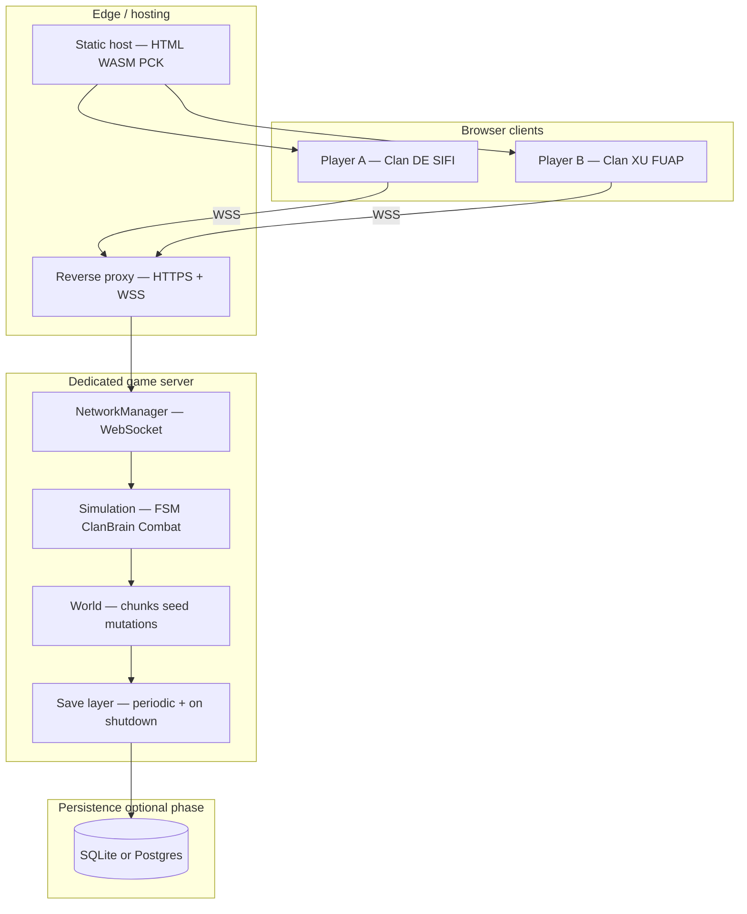
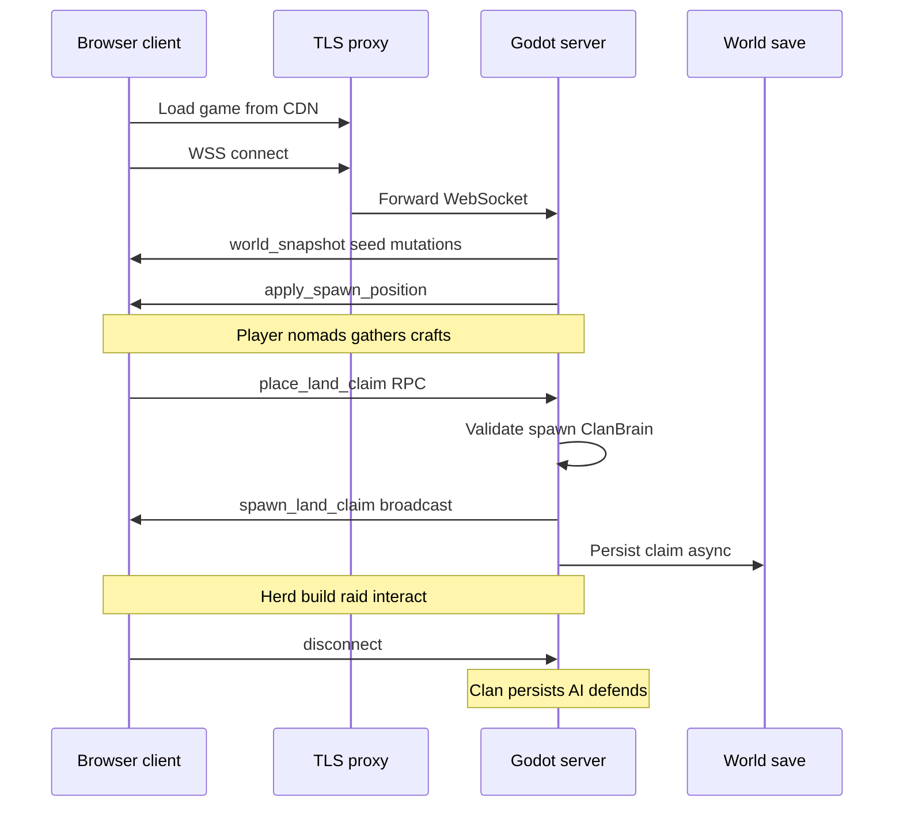

# Multiplayer Concept — Browser, Persistent Server, Player-Owned Clans

**Last updated:** July 2026  
**Status:** Design / strategy (not a promise of shipped features)  
**Companion docs:** [multiplayer.md](multiplayer.md) (implementation checklist), [game_map.md](game_map.md) §14 (chunk + MP hooks), [bible.md](bible.md) §XX-A, [psycology.md](psycology.md) (encounter tension)

---

## 1. What we are building

**Player-facing goal:** *Stone Age Clans* runs in a **web browser**. Players connect to a **shared, always-on world**, spawn as a hominid, and **start or rejoin their own clan** — place a land claim, herd people and animals, build, survive, raid, and interact with other human players and AI clans in the same world.

**Technical goal:** One **dedicated server** owns all gameplay truth. Browser clients are **thin clients**: they send input, render what the server tells them, and play animations. The world **persists** across player logouts and (eventually) server restarts.

This is not “host a game from your laptop.” It is closer to a **small persistent survival MMO** — one shard/world to start, many clans, emergent PvP and diplomacy.

---

## 2. Why this architecture fits *this* game

Stone Age Clans is built around:

| Design pillar | Multiplayer implication |
|---------------|-------------------------|
| **Emergent simulation** (hunger, raids, rivalries, droughts) | Server must run **ClanBrain**, FSM, combat, economy — clients cannot simulate NPC logic |
| **Territory & generations** (land claims, huts, babies → clansmen) | Clan state is **long-lived server data**, not a session blob |
| **Tense rare encounters** ([psycology.md](psycology.md)) | Shared world + fog-of-war later → human vs AI ambiguity |
| **Chunk + seeded world** ([game_map.md](game_map.md)) | `world_seed + chunk_coords` for static layout; **MutationStore** for player changes — correct MP pattern |
| **RTS squads + herding** | High interaction count near the player; needs **interest management**, not full-world replication |

**Recommendation:** **Godot 4 headless dedicated server + Godot Web export clients + WebSocket (WSS in production).**

Do **not** start with a custom Node.js game simulation or a third-party netcode layer that reimplements ClanBrain outside Godot. The sim is already in GDScript; moving authority to a headless Godot instance reuses combat, herd, gather, and AI with the smallest conceptual leap.

---

## 3. System overview

### 3.1 Three deployable artifacts

| Artifact | Role | Recommended stack |
|----------|------|-------------------|
| **Web client** | Game UI in browser | Godot **Web** export → static files on CDN (Cloudflare Pages, Netlify, S3+CloudFront) |
| **Game server** | Authoritative sim 24/7 | Godot **headless** Linux binary on VPS; **systemd** or Docker restart |
| **TLS terminator** | Browsers require secure WebSocket on HTTPS sites | **Caddy** (auto TLS) or **nginx** + Let’s Encrypt |

### 3.2 Transport

| Option | Verdict for browser MP |
|--------|-------------------------|
| **WebSocket** (`WebSocketMultiplayerPeer`) | **Recommended.** Already in `scripts/network/network_manager.gd`. Works in browser. |
| ENet (UDP) | **Not for browser clients.** Fine for native desktop ↔ server later as an optional fast path. |
| WebRTC | Possible for P2P; **not recommended** for authoritative persistent world (NAT, host trust, cheat surface). |

### 3.3 Server model

| Model | Fit |
|-------|-----|
| **Dedicated headless Godot** | **Best fit.** One process, one world, server guards already started in combat/herd/sim code. |
| Listen-server (player hosts) | Poor fit for persistent clans and browser players. |
| External relay only (no sim) | Still need a sim somewhere; adds complexity without removing Godot work. |

**Default port:** `9080` (see `NetworkManager.DEFAULT_PORT`). Production exposes **443/WSS** via proxy, not raw 9080 to the public internet.

---

## 4. Core design decisions (recommended)

### 4.1 Authority: server owns everything that matters

**Server runs:**

- NPC FSM + ClanBrain + herd influence resolution
- CombatTick / CombatScheduler / damage application
- Gathering, crafting, building placement validation
- Inventory and land-claim mutations
- `SimulationManager` economy ticks
- Chunk **interest** (which chunks stay loaded)

**Clients run:**

- Local player **input** capture
- **Interpolation** of remote entities (players, NPCs)
- UI, audio, particles, camera
- Optional **prediction** for own movement only (Phase 2 polish)

**Pattern already in repo:** `multiplayer.is_server()` guards in `combat_tick.gd`, `combat_scheduler.gd`, `herd_manager.gd`, `simulation_manager.gd`, and `is_multiplayer_authority()` on `npc_base.gd` / `player.gd`. Extend this pattern; do not fork logic.

### 4.2 World model: one shared shard

**Recommendation for v1:** **Single persistent world** (one server, one `world_seed`, one `MutationStore`).

| Alternative | Trade-off |
|-------------|-----------|
| Instanced match / room per clan | Easier tech; **kills** rare cross-clan encounters and raid fantasy |
| Procedural “server per region” | Hard ops; defer until player count forces it |
| Seasonal wipe worlds | Good for survival genre **later**; document as live-ops choice, not engineering default |

Player **spawn zones** already use `WorldGenConfig.player_spawn_zones` → `GameSync.consume_spawn_world_position_for_peer`. New players should spawn **far enough apart** to nomad early-game without instant griefing, but still in the same world.

### 4.3 Identity: clan ownership

**“Start your own clan”** in gameplay terms:

1. Player connects → server assigns `peer_id` (session) and eventually `account_id` (persistent).
2. Player places **land claim** → server creates territory, **ClanBrain**, clan name, and sets `owner_account_id` (or `owner_peer_id` in MVP).
3. Herded NPCs join that clan; buildings and inventories attach to claim.
4. On disconnect, **clan remains** in the world (AI can defend poorly if unattended — intentional tension).

**Recommended identity progression:**

| Stage | Mechanism | Persistence |
|-------|-----------|-------------|
| **MVP** | Guest name + server maps `peer_id → clan` while connected | Clan persists in server RAM; reconnect = new character unless you add save |
| **Beta** | Simple account (email magic link or username + password hash) | `account_id` owns clan; save on logout |
| **Live** | Same + optional Steam / itch / OAuth later | Cross-device clan access |

**Do not** tie clan permanence to WebSocket `peer_id` alone — it changes every connection.

### 4.4 Persistence layers

Three levels; build in order:

| Layer | What is saved | When |
|-------|---------------|------|
| **L1 — World deltas** | `MutationStore` (depleted nodes, grass cleared, etc.) | Already designed; extend save/load |
| **L2 — Player structures** | Land claims, buildings, inventories, NPC roster, ClanBrain state | Periodic (e.g. every 5 min) + graceful shutdown |
| **L3 — Accounts** | Login → clan id mapping, ban list, settings | Database outside or beside Godot |

**Recommended save format for L1+L2:** JSON or binary snapshot Godot writes to disk; **SQLite** for L3 and index of saves. **Postgres** when you need multiple server processes or admin tooling — not required on day one.

**Critical:** Seeded chunk content regenerates from `world_seed`; only **mutations** and **hand-placed entities** must persist. Do not save every tree — save what changed ([chunk-spawn rules](../.cursor/rules/chunk-spawn-seeded-worldgen.mdc)).

### 4.5 Sync strategy (bandwidth-aware)

Stone Age Clans can have **many NPCs** near a claim. Blindly syncing every entity at 60 Hz will fail.

**Recommended rates (starting point):**

| Data | Rate | Channel |
|------|------|---------|
| Local player input | Every physics frame → server | Reliable or unreliable RPC |
| Player positions | 20 Hz | Unreliable |
| NPC positions (in interest) | 10–15 Hz | Unreliable |
| Combat events (hit, death, agro spike) | Event-driven | Reliable |
| Inventory / build / clan join | Event-driven | Reliable |
| Simulation tick / food buffer | On `simulation_tick` (~120s) | Reliable |

**Interest management (required before ~10 concurrent players):**

- Server loads chunks if **any** player is within radius (union of peer chunk disks — **not implemented yet**; see [game_map.md](game_map.md) §14).
- Only replicate entities in **loaded chunks ± margin**.
- Defer full fog-of-war until base replication works; design with it in mind ([psycology.md](psycology.md)).

### 4.6 Determinism

**Recommendation:** Server uses **one seeded RNG** (`RandomNumberGenerator` with `world_seed` + salt per subsystem) for:

- AI rolls, herd steal chances, spawn tables in loaded chunks
- Loot / gather outcomes where clients could otherwise disagree

**Known gap today:** Some paths still use bare `randi()` (e.g. tall grass texture pick in `ChunkManager` — [game_map.md](game_map.md) §16). Fix as part of MP hardening, not optional polish.

Clients **never** roll gameplay RNG for authoritative outcomes.

---

## 5. Player journey (end-to-end)

1. **Load** — Browser downloads WASM + PCK (~tens of MB first visit; cache afterward).
2. **Connect** — Lobby: server URL (or fixed prod URL). `NetworkManager.connect_to_server("wss://play.example.com")`.
3. **Catch-up** — `receive_world_snapshot` applies seed + mutations; server sends entities in interest region.
4. **Play** — Nomadic loop until land claim; clan growth; optional PvP/raid.
5. **Leave** — Clan stays; structures and NPCs remain unless raided.
6. **Return** — Account login restores **membership** to clan (not necessarily respawn at exact body if permadeath rules apply — design choice).

---

## 6. Phased delivery plan

Use [multiplayer.md](multiplayer.md) as the **task checklist**. This section is the **strategic order** with success criteria.

### Phase A — Browser-ready single player

**Goal:** Prove Web export without networking.

- Web export preset (`export_presets.cfg` exists)
- Stub or disable: `FileAccess`, CLI args, playtest file logging on `OS.get_name() == "Web"`
- Fix compile errors that block the whole project (scripts must load cleanly)
- Audio: unlock on first user click (browser policy)

**Done when:** One URL, solo play: move, gather, claim, build.

### Phase B — Headless server + handshake

**Goal:** Server runs 24/7; browser connects; no gameplay yet.

- Linux headless build; `start_server()` on boot
- WSS via Caddy/nginx
- Simple connect UI; log peer connect/disconnect

**Done when:** Two browser tabs show “connected”; server survives overnight.

### Phase C — Players in shared space

**Goal:** See each other move.

- Network IDs for players
- Input → server → `broadcast_player_state` (implement stub in `game_sync.gd`)
- Camera follows local player only

**Done when:** Two humans walk around the same map.

### Phase D — Shared world + “start a clan”

**Goal:** First real multiplayer gameplay loop.

- Server-only world spawn (NPCs, resources)
- Server-validated **land claim placement** → clan creation broadcast
- `MutationStore` synced on join; server-only mutations thereafter
- Chunk union interest for multiple players

**Done when:** Player A’s claim and herd are visible to Player B; chopped resources stay depleted.

### Phase E — Full sim authority

**Goal:** Combat, gather, build, inventory, herd — all server-side.

- Finish guards on remaining systems
- Event RPCs for combat hits, inventory deltas, building state
- AI clans and human clans share rules

**Done when:** Playtest checklist in [PLAYTEST.md](PLAYTEST.md) passes with two clients.

### Phase F — Persistence + accounts

**Goal:** World and clans survive restart; players reclaim their clan.

- L2 world save; L3 accounts
- Reconnect flow; optional graceful “abandon clan” / leadership transfer rules

**Done when:** Restart server; log in; your claim still exists.

### Phase G — Scale & polish

- Interest management tuning, delta compression
- Anti-cheat validation (rate limits, movement sanity)
- Metrics, admin console, backups
- Fog of war (gameplay + bandwidth win)

---

## 7. Serious limitations and mitigations

### 7.1 Godot Web export constraints

| Limitation | Impact | Mitigation / trade-off |
|------------|--------|-------------------------|
| **Download size** (WASM + PCK) | Slow first load on mobile networks | Split PCK; CDN caching; progressive load screen; trim unused assets |
| **No threads by default** (`thread_support=false` in export preset) | Main-thread spikes → tab freezes | Keep sim on server; client only renders; avoid heavy work per frame on web |
| **No `FileAccess` / shell / CLI** | Playtest tooling breaks | `#if OS.get_name() != "Web"` stubs; URL params for debug |
| **Memory ceiling** (~2 GB typical browser tab) | Large worlds + many sprites | Chunk streaming on **client** too; lower load radius on web preset |
| **Audio autoplay blocked** | Silent until click | “Click to start” splash that unlocks audio |

### 7.2 Simulation scale

| Limitation | Impact | Mitigation / trade-off |
|------------|--------|-------------------------|
| **Many NPCs + FSM** | Server CPU is the bottleneck | Server-side interest; sleep distant AI; cap AI clan count per world; `SimulationManager` tick already batches economy |
| **Herd influence is chatty** | Many overlap events (see playtest: 1000+ `herd_wildnpc_can_enter` rejects) | Server-only herd resolution; do not replicate every probe; replicate outcomes |
| **Combat + agro** | Desync if run on clients | Already guarded — **never** revert to client authority for hits |
| **Single Godot process** | One CPU-heavy thread for much of the sim | **Accept for v1** (target ~20–50 concurrent); later: shard worlds or offload hot paths |

**Realistic v1 target:** **~10–30 concurrent players** on a mid-tier VPS with tuning. Not 500-player battle royale. Genre fit: sparse encounters, not cluster fights everywhere.

### 7.3 World & chunk architecture gaps (honest)

From [game_map.md](game_map.md) §16 — these **will bite** multiplayer if ignored:

| Gap | Risk | Recommended fix |
|-----|------|-----------------|
| **Single-player chunk interest** | Unloaded chunks for Player A while Player B is there | Implement **union interest** on server `ChunkManager` |
| **Claims not pinned to chunks** | Unload might despawn nearby content inconsistently | Pin chunks that contain player claims / buildings |
| **Seeded clans under `Chunk_*`** | Disappear on unload | Reparent persistent clans to `world_objects` or record in mutation save |
| **Ground items spawned near player globally** | Double density with chunk items | Server-only spawn; one code path per chunk mode |
| **`randi()` in grass** | Cosmetic desync | Low priority; fix with seeded RNG |

### 7.4 Latency & feel

| Limitation | Impact | Mitigation / trade-off |
|------------|--------|-------------------------|
| **100–200 ms RTT** common on WiFi | Movement feels mushy | Client prediction for **own** player only; interpolation for others |
| **RTS squad commands** | Delay before followers react | Immediate local UI feedback; server confirms; avoid “cancel on RTT” |
| **Herd steal timing** | Feels unfair if client sees steal before server confirms | Show tentative VFX; authoritative attach only on server ack |

**Trade-off:** Competitive twitch PvP needs prediction + lag compensation. Survival/RTS hybrid can tolerate **server-authoritative with light prediction** — matches Stoneshard/RimWorld pacing better than fighting games.

### 7.5 Cheating

Browser clients are **fully inspectable**.

| Threat | Mitigation |
|--------|------------|
| Speed hack / teleport | Server validates position deltas; cap speed; snap back |
| Fake gather / craft | Server validates tool, range, inventory |
| Fake damage | Only server applies `HealthComponent` changes |
| Botting | Rate limits; captcha on account create; behavioral flags (later) |

**Rule:** If the client can do it without server ack, it’s a bug.

### 7.6 Persistence & ops

| Limitation | Impact | Mitigation / trade-off |
|------------|--------|-------------------------|
| **Save corruption** | Whole world loss | Atomic writes; backup every N minutes; keep last 3 snapshots |
| **Long save times** | Lag spike | Async save thread (headless OK); save subset incrementally |
| **Player gone 6 months** | Dead clutter on map | Optional decay rules (structures weaken); nomad/abandon camp already in design ([camp_relocation.md](camp_relocation.md)) |
| **Griefing** | Raiders wipe new players | Spawn protection zone; newbie buffer; PvE-only shards as **later** opt-in, not default if genre is harsh |

### 7.7 Design tension: rare encounters vs many players

[psycology.md](psycology.md) wants **uncanny, rare** hominid contact. A busy server works against that.

**Recommended hybrid:**

- **Low player density** via large world + spread spawn zones
- **Fog of war** hides distant players (when implemented)
- **AI clans** fill the world so humans are not the only threat
- Cap **concurrent** players per shard before adding second shard

**Trade-off:** Queue / “server full” vs immersion. Prefer **immersion** for this game’s identity.

---

## 8. What not to do (early)

| Temptation | Why skip |
|------------|------------|
| Rewrite sim in Rust/Node “for performance” | Years of rework; Godot headless is enough to validate |
| Peer-to-peer hosting | No persistence; NAT pain; cheat trust |
| Sync every NPC every frame to everyone | Bandwidth collapse |
| Client-side ClanBrain “for smoothness” | Desync and exploit city |
| Multiple worlds before one works | Ops multiplier |
| Full MMO accounts + monetization before land-claim MP | Block fun loop |

---

## 9. Recommended MVP scope (smallest fun slice)

Ship multiplayer when this works:

1. Browser client connects to public WSS server
2. Two players see each other move
3. Each can place **one** land claim and name a clan
4. Herd **one** woman + **one** animal into claim; join clan persists on server
5. Gather + deposit + one building (e.g. Living Hut)
6. Server restart **does not** wipe claims (L2 save)
7. Guest reconnect within 24h reclaims same clan (cookie/token MVP)

**Explicitly defer:** fog of war, cross-shard matchmaking, native desktop client, WebRTC, full raid balance pass, cosmetics shop.

---

## 10. Hosting sketch (production)

| Piece | Suggested provider | Notes |
|-------|-------------------|-------|
| Game server | Hetzner / DigitalOcean / Fly.io | 4 vCPU / 8 GB RAM to start; Linux |
| Static client | Cloudflare Pages | Free tier; global CDN |
| TLS | Caddy on same VPS or Cloudflare proxy | WSS to Godot |
| DB (phase F) | Managed Postgres or SQLite file | SQLite OK for &lt;1k accounts |
| Backups | S3 / Backblaze B2 | Automated world snapshots |

**Cost ballpark (early):** ~$20–40/mo for VPS + domain; scales with player count and save size.

---

## 11. Testing strategy

| Test | How |
|------|-----|
| Local | Headless server + 2 browser tabs |
| CI | Headless `--playtest-2min` on server build only (already have instrumentor) |
| Load | Bot clients (Godot headless “dumb walkers”) before real marketing |
| Regression | JSONL playtest analyzer for herd/combat churn ([clanbrain_report.md](clanbrain_report.md)) |

---

## 12. Open design questions (decide before Phase F)

| Question | Options | Recommendation |
|----------|---------|----------------|
| Permadeath for player character? | Full / partial / none | Partial: character dies; clan persists with NPCs |
| Offline raid protection? | Shield timer / only when online / none | None or short shield — matches harsh genre; tune later |
| Clan name uniqueness? | Global unique / per-region | Global unique on shard |
| Max players per shard? | Hard cap | Start 30; tune from metrics |
| Wipe policy? | Never / seasonal | Seasonal optional; communicate early |

---

## 13. File & code map (starting points)

| Area | Path |
|------|------|
| WebSocket peer | `scripts/network/network_manager.gd` |
| Spawn + snapshot | `scripts/network/game_sync.gd` |
| MP guards (examples) | `combat_tick.gd`, `herd_manager.gd`, `npc_base.gd`, `player.gd` |
| World seed + chunks | `scripts/world/chunk_manager.gd`, `chunk_generator.gd` |
| Mutations | `scripts/world/mutation_store.gd` |
| Economy tick | `scripts/systems/simulation_manager.gd` |
| Web export | `export_presets.cfg` |
| Implementation tasks | [multiplayer.md](multiplayer.md) |

---

## 14. Summary

**Best fit for Stone Age Clans:** a **single-shard, server-authoritative, WebSocket-based** persistent world where clans are **server-owned state** tied to accounts, built on the existing **chunk + seed + mutation** architecture and GDScript sim.

**Biggest risks:** Godot Web size/perf, **chunk interest for multiple players**, bandwidth from herds/NPCs, and the sheer **surface area** of server-guarding every system.

**Biggest advantage:** Multiplayer stubs, spawn zones, mutation snapshots, and server guards **already exist** — the project is pointed the right direction; the work is finishing authority, replication, and persistence in the right order.

Next implementation doc to execute against: **[multiplayer.md](multiplayer.md)** Phase 1 → 8.
