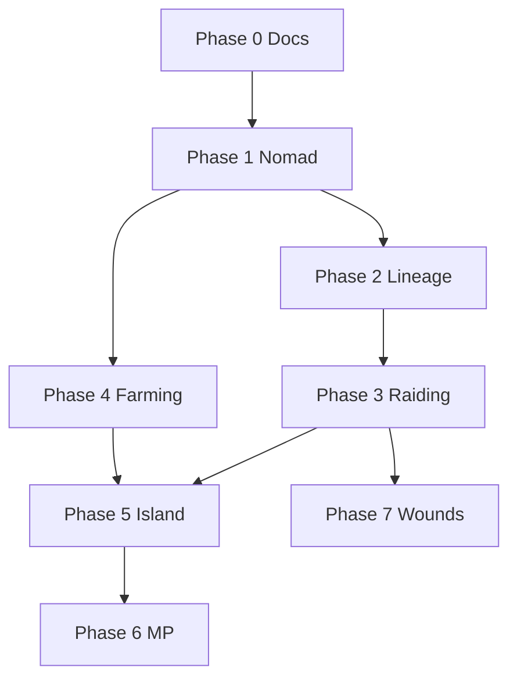

# Stone Age Clans — roadmap 2026

**Owner doc:** [earlygame_vision.md](earlygame_vision.md)  
**Last updated:** September 2026  
**Map guide:** **[environment_goal.md](environment_goal.md)** · [island_map.md](island_map.md) · [`assets/island_map2.jpg`](assets/island_map2.jpg)

This is the **single ordered list** for nomad → island MP → raid economy → settlement depth. Check off in PRs; details live in linked docs.

---

## Phase 0 — Doc & bible hygiene ✅ (Sep 2026)

- [x] Tier 1 = Campfire, Tier 2 = Flag
- [x] Herding via context menu (not right-click)
- [x] Future vs shipped split in bible §XXI / §XXII
- [x] [earlygame_vision.md](earlygame_vision.md), [island_map.md](island_map.md), future implementation stubs

---

## Phase 1 — Nomad loop polish (gameplay)

**Goal:** First 10 minutes fun on **current** infinite map; same rules later on island.

| # | Task | Doc |
|---|------|-----|
| 1.1 | Three foods / one hunger bar clarity in UI | [earlygame_vision.md](earlygame_vision.md) §3 |
| 1.2 | Campfire abandon + relocate without duping herd | [nomad.md](nomad.md) |
| 1.3 | War Horn: don’t break active herding / future cordage | [earlygame_vision.md](earlygame_vision.md) §6 |
| 1.4 | Genetics panel (read-only traits) | [earlygame_vision.md](earlygame_vision.md) §8 |

---

## Phase 2 — Lineage & female babies

**Goal:** Internal clan growth + genetics graph.

| # | Task | Doc |
|---|------|-----|
| 2.1 | `Person` / `person_id` registry | [lineage.md](future%20implementations/lineage.md) |
| 2.2 | Sex at birth + promote to clanswoman | [female_baby.md](future%20implementations/female_baby.md) |
| 2.3 | Inbreeding coefficient (soft penalty) | female_baby § inbreeding |
| 2.4 | Living Hut gate for clan-born women | [women4.md](Phase4/women4.md) |

---

## Phase 3 — Herdable raiding (cordage)

**Goal:** Four raid verbs; STEAL is economic PvP.

| # | Task | Doc |
|---|------|-----|
| 3.1 | Cordage item + bind cap 2 | [herdable_raiding.md](future%20implementations/herdable_raiding.md) |
| 3.2 | Delivery consumes cordage in **own** claim | same |
| 3.3 | STEAL: defend-only, no flag path | same |
| 3.4 | WIPE abort while bound herdables in enemy radius | same |
| 3.5 | ClanBrain raid scoring (food buffer) | [clanbrain_raid_scoring.md](future%20implementations/clanbrain_raid_scoring.md) |

---

## Phase 4 — Proto farming

**Goal:** Grain loop on **flag** claims only.

| # | Task | Doc |
|---|------|-----|
| 4.1 | Field building + crop ring placement | [proto_farming.md](future%20implementations/proto_farming.md) |
| 4.2 | Wild wheat → claim Field → Oven bread | [earlygame_vision.md](earlygame_vision.md) §3 |
| 4.3 | Biome bias: river floodplains on map2 | [environment_goal.md](environment_goal.md) §3 |

---

## Phase 5 — Authored island

**Goal:** Replace infinite plane for main game; map2 silhouette.

| # | Task | Doc | Status |
|---|------|-----|--------|
| 5.1 | Biome mask from map2 + organic shaping | [environment_goal.md](environment_goal.md) · [island_map.md](island_map.md) §1c | ✅ Baseline (`rebuild_island_biomes.sh`); desert % tuning ⬜ |
| 5.2 | Ocean boundary + rivers crossable | [environment_goal.md](environment_goal.md) | 🟡 Masks + `TerrainQuery.is_water()`; gameplay wiring ⬜ |
| 5.3 | Four quadrant spawns | [island_mp.md](future%20implementations/island_mp.md) |
| 5.4 | Claim non-overlap validation | island_mp |
| 5.5 | Retire “rocky = no food” on island chunks | off_screen_clan_balance |

---

## Phase 6 — Island multiplayer

| # | Task | Doc |
|---|------|-----|
| 6.1 | Chunk interest union (all peers) | [multiplayer.md](multiplayer.md) |
| 6.2 | Server herd / raid authority | herdable_raiding |
| 6.3 | Disconnect → ClanBrain runs claim | island_mp |
| 6.4 | Domination panel | island_mp |

---

## Phase 7 — Combat depth (later)

| # | Task | Doc |
|---|------|-----|
| 7.1 | Living wounds | [wounds.md](future%20implementations/wounds.md) |
| 7.2 | Raid score uses wounded count | clanbrain_raid_scoring |

---

## Dependency graph

---

## What we are **not** doing first

- Full concentric-ring worldgen without map2 mask
- Hard ban on inbreeding
- Flag destruction on STEAL/LOOT
- Oven on campfire tier (design: flag-only Field; code may still allow Oven on Tier 1 until tightened)

---

## Index

| Doc | Role |
|-----|------|
| [earlygame_vision.md](earlygame_vision.md) | Player-facing first 10 min |
| [environment_goal.md](environment_goal.md) | Canonical map, biomes, weather, wildlife |
| [island_map.md](island_map.md) | Map2 art checklist |
| [roadmap_2026.md](roadmap_2026.md) | This file |
| [future implementations/README.md](future%20implementations/README.md) | All future specs |
