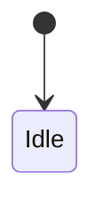

# [System name] — canon

**Status:** `Draft` | `Partial` | **Locked** | `Deprecated`  
**Lock date:** YYYY-MM-DD (when status = Locked)  
**Owner doc:** this file (or link if split)  
**Supersedes:** (older docs to ignore)  
**Code truth (until implemented):** paths to scripts/scenes  

**See also:** (max 5 links)

---

## 0. One-paragraph intent

What this system is for in player fantasy and in the simulation. One or two sentences a new contributor can read first.

---

## 1. Scope & boundaries

| In scope | Out of scope (other systems) |
|----------|------------------------------|
| | |

**Multiplayer rule:** Who has authority (server/client)? What replicates?

---

## 2. Player-visible behavior

What the player sees and does. Controls, UI, feedback, failure messages.

---

## 3. Core rules (bulletproof logic)

Numbered **MUST** / **MUST NOT** rules. No ambiguity.

1. …
2. …

**Edge cases** (table):

| Situation | Expected outcome |
|-----------|-------------------|
| | |

**Conflicts with other systems:** How this resolves (priority, cancel, queue).

---

## 4. Data model

Entities, enums, keys on nodes, save fields, network IDs.

```text
(example structs / meta keys — not full code unless helpful)
```

---

## 5. State machine / lifecycle (if applicable)

States, transitions, who triggers them, tick rate.



---

## 6. Integration map

| Other system | Direction | Contract |
|--------------|-----------|----------|
| ClanBrain | in/out | |
| FSM | | |
| Inventory | | |

---

## 7. Economy & balance hooks

Tunable numbers live in `BalanceConfig` / `NpcConfig` / named exports — list **names**, not final values unless locked.

| Knob | Purpose |
|------|---------|
| | |

---

## 8. Implementation status

| Piece | Shipped? | File / test |
|-------|----------|-------------|
| | | |

---

## 9. Test & verification

How we prove it works: headless script, playtest capture, ClanBrain report lines, invariants.

---

## 10. Open questions

Only **unresolved** design — not “TODO implement.” Move to §3 when decided.

---

## 11. Changelog

| Date | Change |
|------|--------|
| | |
